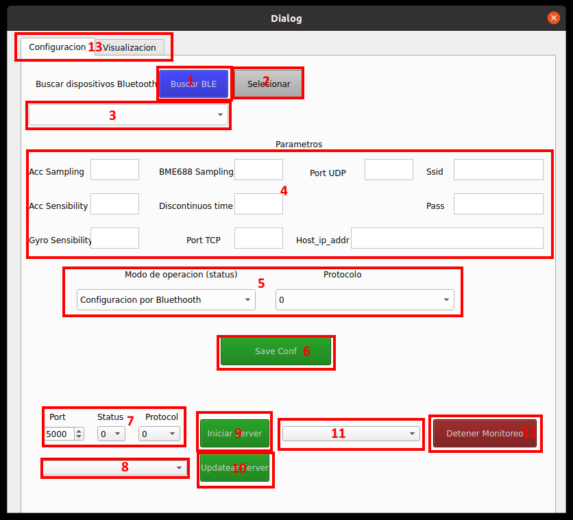
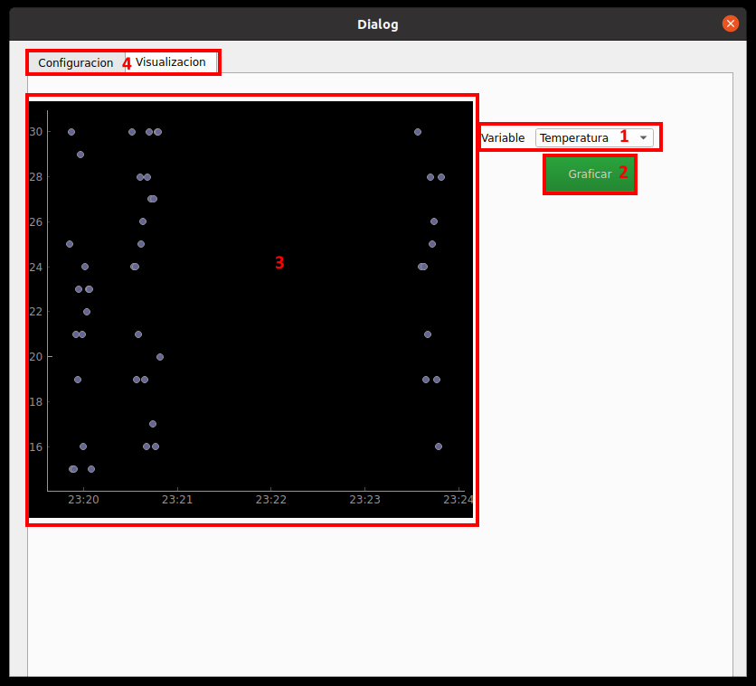

# Explicación de la interfaz

A continuación se explicara cada botón, zona y caja de la interfaz.

* **1. Botón de escaneo de dispositivos**, al apretarlo tras 5 segs va en 3. poner los dispositivos disponibles cercanos.
    
* **2. Seleccionar**, al apretarlo se prueba conexión leyendo las caracteristicas del dispositivo seleccionado en 3. ES NECESARIO APRETARLO ANTES DE PODER ENVIAR UNA CONFIG. De momento solo es posible ver en la terminal donde se este ejecutando si es que la conexión fue exitosa.
    
* **3. Barra dropdown**, aquí es una lista de los dispositivos BLE disponibles. Comienza vacía.
    
* **4. Zona de parametros**, aquí se rellena la configuración como esta descrita en el enunciado de la tarea, es importante rellenarla completamente para poder enviarla o updatear un server. 
    
* **5. Zona de Operacióń y Protocolo**, aqui en las barras dropdown seleccionas que modo de operación y protocolo estas mandando junto a la configuración, tal como esta descrito en el enunciado de la tarea (no todos los modos están implementados en el chip ESP32).
    
* **6. Boton save config**, al apretarlo envias la configuración escrita al último dispositivo BLE seleccionado.
    
* **7. Configuración de Server**, aquí pones la configuración de un server que reciba los datos, el cual puedes iniciar con 9.
    
* **8. Selección de Server a Updeater**, aquí puedes seleccionar entre los servers en los distintos puertos y configuraciones que ya hayas abierto.
    
* **9. Iniciar Server**, al apretar este botón se inicia un server para recibir los datos enviados por un chip ESP32 con la configuración dada en 7. Se crea como un Thread.
    
 * **10. Updatear Server**, al apretar el botón reconfigura la esp32 que este conectada al server seleccionado en 8. con toda la configuración que este escrita en 4.
    
 * **11. Selección server a detener**, aquí puedes seleccionar entre los server de recepción activos en este computador/raspberry, para poder detenerlo con 12.
    
 * **12. Detener Monitoreo**, al apretar este botón el server seleccionado en 11. es cerrado completamente. Se cierra su Thread.
    
 * **13. Configuración/Visualización**, cambiar entre esta ventana de configuración y la de visualización. 

 * **1. Variable**, dropdown bar donde seleccionas cual de todas las variables disponibles quieres graficar.
    
 * **2. Graficar**, al apretar este botón se grafica los datos de la base de datos respecto a la variable seleccionada en 1. vs el tiempo en que fueron guardada. Se grafica TODO lo que haya en la base de datos al respecto.
    
 * **3. Caja de grafico**, donde se visualiza el gráfico.
    
 * **4. Configuración/Visualización**, cambiar entre esta ventana de configuración y la de visualización.

## Modo de uso:
Si es que DB.sqlite no existe, ya sea porque es la priemra vez que se usa la interfaz, o porque se elimnó (los gráficos no se ven muy bien cuando los datos llegan en momentos muy distintos), hayq ue ejecutar sqlInit.py una vez para crear la base de datos.

La interfaz se lanza ejecutando mainWithSetup.py. Solo funciona en sistemas con linux por tema de dependencias de Pygatt.

Para utilizar la aplicación, primeramente se debe buscar con el boton azul los dispositivos cercanos, seleccionas el deseado y posible de configurar tras lo cual apretas seleccionar para probar la conexión, en caso de una conexión exitosa (mirar terminal donde se este ejecutando, debe mostrar las caracteristicas disponibles) continua.

### Configuración ESP32
Para configurar una ESP32 necesitas rellenas correctamente todos los parametros (existen limitaciones de tamaño, 10 de largo para ser especifico, en nombre y pass del wifi, junto con que la IP debe ser bien escrita con sus puntos), y seleccionar que clase de modo (status) y protocolo use, también te aseguras que hayas probado la conexión BLE con esta previamente, tras lo cual apreta save Config. Si conecta bien y enviaste lo correcto debería estar correctamente configurada. LA RASPBERRY PUEDE TARDAR E INCLUSO FALLAR EN ESTE PASO, DADO SU CAPACIDAD BLUETOOTH.

### Abrir server de Recepción
Si quieres abrir un servidor para recibir los datos, se puede en el costado abajo-derecho de la interfaz, donde puedes seleccionar puerto, status y protocolo de este antes de iniciarlo, también es posible updatear la configuración de la ESP32 conectada en este con updatear (explicación en la sección anterior). En caso de querer cerrar un server ya abierto el costado abajo-izquierdo tiene un boton y selección para eso.

### Visualizar los datos
Llendo a la otra parte de la ventana del programa podras visualizar los datos. Seleccionas la variable a graficar y apretar graficar, se mostrara TODOS los datos de la base de datos respecto al momento en que se recibieron.

## Base de Datos: 

La base de datos usa SQLITE, con una tabla simple con las siguientes columnas:
    * MessageId: Llave primaria
    * MAC: MAC de la ESP32 que mandó un mensaje
    * Status: Status del mensaje recibido (0, 20, 21, 22, 23, 30, 31)
    * Protocol: Protocolo del mensaje recibido (0, 1, 2, 3, 4, 5)
    * Timestamp: Timestampo del momento en que se guardó el mensaje
    * Data: Datos del mensaje, guardados en un string con formato JSON

## Archivos:

* **config.py:** Se encarga de generar y empaquetar mensajes de configuración para configurar la ESP32
* **DataParse.py:** Se encarga de parsear y guardar la info recibida
* **DB.sqlite:** La BDD
* **ejemplo_tarea2.ui:** el arhivo para generar la UI de qtdesigner
* **ex.py:** la UI generada
* **findAddresses.py:** Se encarga de encontrar los dispositivos Bluetooth dipsonibles
* **graph.py:** Se encarga de sacar losd atos de la BDD y prepararlos apra ser graficados
* **mainWithSetup.py:** Junta todo para las funciones de la interfaz, es el archivo principal que ejecuta tanto la configuración por BT inicial como recepción de datos y su graficación.
* **rServer.py:** Se encarga de crear los servidores que reciben la info
* **sqlInit.py:** inicializa la BDD
